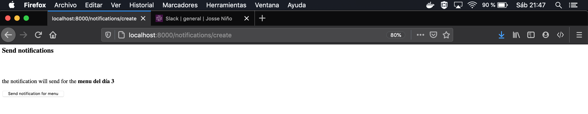
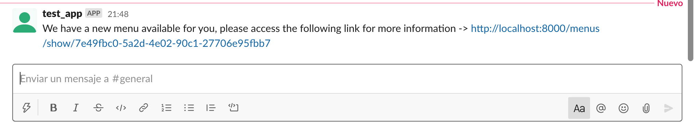
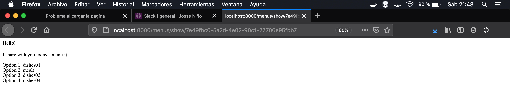

# django-cornershop-test

Here is the test for cornershop where it contains the following points 

1. Creation of menus 
2. Creation of dishes from the menu 
3. Creation of slack notification

The application runs through Docker using docker compose


# Test your app bootstrapping

In your_super_awesome_project/settings.py

Look 
ALLOWED_HOSTS = []

And change it for
ALLOWED_HOSTS = ["*"]

```bash
docker-compose run web python manage.py runserver 0.0.0.0:8080
```

# Run application

```bash
docker-compose up --build
```

# Slack notifications

First of all, you need to make these changes for slack notifications to work

1.- Change the token in the file 
```bash
notifications/view.py
```
2.- Add the slack application created to the general channel

To test the slack notifications, go to this link, when the application is running.

# Funcionality test






## License
[MIT](https://choosealicense.com/licenses/mit/)